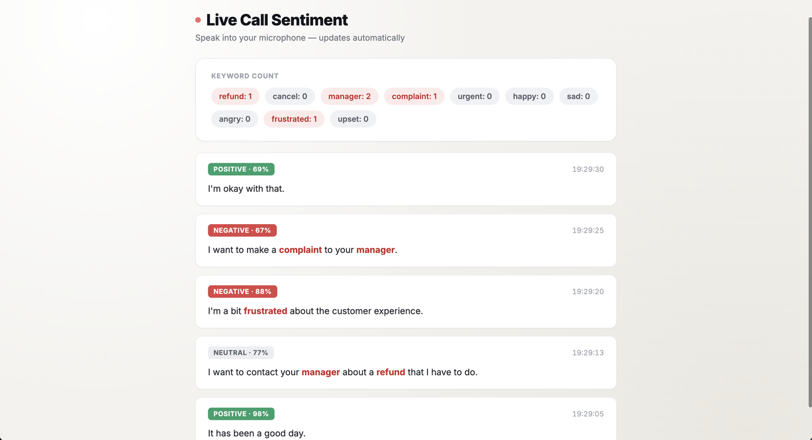

# Whisper + RoBERTa Live Sentiment Analysis

Real-time pipeline that listens to your microphone, transcribes speech locally with
[faster-whisper](https://github.com/SYSTRAN/faster-whisper) (via
[RealtimeSTT](https://github.com/KoljaB/RealtimeSTT)), and scores the sentiment of each
transcribed phrase using
[cardiffnlp/twitter-roberta-base-sentiment-latest](https://huggingface.co/cardiffnlp/twitter-roberta-base-sentiment-latest).

```
mic audio -> RealtimeSTT (faster-whisper) -> text -> RoBERTa sentiment classifier -> live result
```

Everything runs locally and offline (after the first run downloads model weights) — no audio
or text leaves your machine.



## Requirements

- macOS (developed and tested on Apple Silicon, CPU-only — no GPU needed)
- [Homebrew](https://brew.sh)
- Python **3.11** specifically. RealtimeSTT's audio dependencies (PyAudio, faster-whisper) are
  built and tested against 3.11 and can fail to install or behave unpredictably on newer
  Python versions.

## Setup

```bash
# 1. Install Python 3.11 and PortAudio (system library PyAudio needs to access the mic)
brew install python@3.11 portaudio

# 2. Create and activate a virtual environment
/opt/homebrew/bin/python3.11 -m venv venv
source venv/bin/activate

# 3. Install dependencies
pip install -r requirements.txt
```

## Usage

Make sure the virtual environment is active (`source venv/bin/activate`) before running any
script below.

### Live transcription + sentiment (main script)

```bash
python live_sentiment.py
```

Speak into your microphone. When you pause, the phrase is transcribed and printed along with
its sentiment:

```
[LIVE TEXT]: "This is great news!" -> [SENTIMENT]: POSITIVE (0.95)
```

Press `Ctrl+C` to stop.

### Web server

```bash
python app.py
```

Starts a FastAPI server on `http://localhost:8000`. The mic-listening pipeline runs in a
background thread; open the page in a browser to see a live-updating feed of everything said,
each entry with a colored sentiment badge (green/red/gray) and confidence %, newest first. Hit
`GET /history` directly for the raw JSON list:

```json
[{"text": "This is great news!", "sentiment": "positive", "score": 0.95, "time": "14:02:10"}]
```

Every phrase is also checked against a predefined keyword list (`KEYWORD_WEIGHTS` in
`app.py`, currently a placeholder — swap in the real list as needed). Matched keywords are
highlighted in the live feed and tallied in a running count panel on the page. Hit
`GET /keywords` for the raw counts:

```json
{"refund": 1, "cancel": 0, "manager": 1, "complaint": 0, "urgent": 0, "happy": 2, "sad": 1, "angry": 0, "frustrated": 1, "upset": 0}
```

#### Weighted call score

Each phrase is also scored -1 (very negative) to +1 (very positive), but only if the model is
at least 60% confident — low-confidence guesses are treated as neutral instead of skewing
results. Each keyword also has a weight from -1 to +1 (e.g. "cancel" is -0.7, "happy" is
+0.5), based on how serious it is rather than just how it sounds.

Click **Start Call** on the page before speaking, and **End Call** when you're done — only
what's said in between counts toward the score. The score panel combines the average
confidence-filtered sentiment with the total keyword impact for that call, clipped to a
-100% to +100% range. You can also drive this over the API:

```bash
curl -X POST http://localhost:8000/call/start
curl -X POST http://localhost:8000/call/end
curl http://localhost:8000/call-score
```

```json
{"score": -90.0, "avg_sentiment": 0.0, "keyword_impact": -0.9, "active": false}
```

Press `Ctrl+C` to stop.

### Standalone test scripts

These isolate each half of the pipeline for debugging:

- `mic_test.py` — transcribes live mic audio only, no sentiment scoring.
- `sentiment_test.py` — runs the RoBERTa classifier against a few hardcoded sample sentences,
  no microphone involved.
- `weighted_score_test.py` — tests the confidence-filtered sentiment scoring on a few sample
  sentences, no microphone involved.
- `call_score_test.py` — tests the full call score (sentiment + keyword weights, clipped to
  -100%/+100%) against a fake multi-line call transcript, no microphone involved.

## Notes

- Uses the `tiny` Whisper model for speed on CPU. It's fast but occasionally mis-transcribes
  unclear audio (including rare hallucinations into other languages). Switch to `model="base"`
  in the `AudioToTextRecorder(...)` call in `live_sentiment.py` for better accuracy at the cost
  of slightly slower transcription.
- macOS will prompt for microphone permission the first time a script runs, and shows a
  mic-in-use indicator in the menu bar while recording — same as any app using the mic.

## Status / Roadmap

- [x] Live mic transcription (Whisper via RealtimeSTT)
- [x] RoBERTa sentiment scoring
- [x] Connected pipeline (mic -> text -> sentiment, live)
- [x] Wrap pipeline in a FastAPI server
- [x] Add keyword detection, highlighting, and live count summary
- [x] Combine confidence-filtered sentiment and keyword weights into one per-call score
- [ ] Expose locally via ngrok
- [ ] Deploy via Cloudflare Worker
- [ ] Replace placeholder keyword list/weights with the real ones
